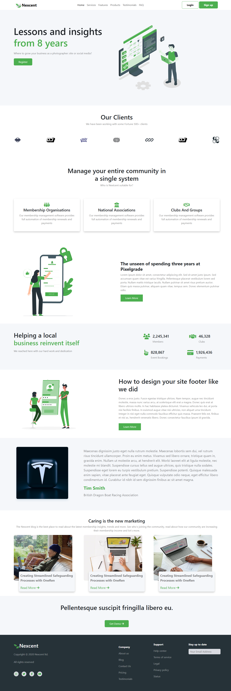

# Landing Page Website

A modern and clean landing page website built to showcase services, features, and client information.
The website focuses on layout, typography, and responsive design using Bootstrap.

## 🚀 Features
- Responsive navigation bar
- Hero section with call to action
- Clients and community sections
- Statistics and product showcase
- Blog / testimonials section
- Clean footer with social links
- Fully responsive layout

## 🛠️ Technologies Used
- HTML5
- CSS3
- Bootstrap

## 📸 Screenshot

## 📌 Notes
- This project is front-end only
- No backend or dynamic functionality included
- Built for practice and learning purposes
