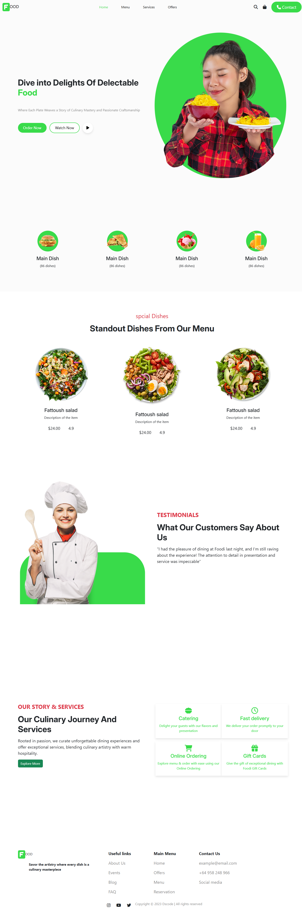

# Restaurant Website

A fully responsive restaurant website designed to display dishes and allow users to make table reservations.  
The website focuses on modern UI, smooth animations, and a great user experience across all devices.

## 🚀 Features
- Display restaurant dishes in an organized layout
- Table reservation section
- Fully responsive design (mobile, tablet, desktop)
- Smooth scroll animations using ScrollReveal
- Clean and modern UI

## 🛠️ Technologies Used
- HTML5  
- CSS3  
- JavaScript  
- Bootstrap  
- ScrollReveal.js  

## 📸 Screenshot
You can view a screenshot of the project here:  

## 📌 Notes
- This project is for learning and practice purposes
- No online ordering or payment system included
- Reservation is front-end only (no backend integration)
